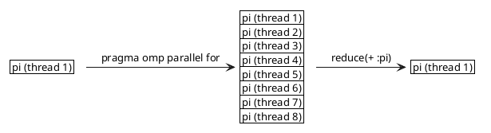

\newpage
# Explanation of the code

For this TP, I use 100000000 circumscribed rectangles.

My code is all done in the main.cpp.
We can execute my code like this:
```bash
./build/tp4
```
Or like this, with the number of threads given to execute parallel section of the code
```bash
./build/tp4 16
```
The default number of threads used is given by the machine (in my machine, this number is 8 whereas on baobab, the default number of thread is 32).


At the begining, I look after parameters, to set up the number of threads (stored in the variable 'nthread').

To change the default number of thread used, which is defined by the machine, I make:
```C++
omp_set_num_threads(nthread);
```
This function defined in 'omp.h' allow us to change the number of thread used to execute parallel sections of our code.

Then, I store the current time to compute at the end of the code the execution time like this:
```C++
// Begining of the code
double start = omp_get_wtime();
...
// End of the code
double end = omp_get_wtime();

// Print execution time:
cout << "Execution time: " << end - start << endl;
```
The function `omp_get_wtime()` is also defined in 'omp.h' and give the current time in second, which is stored, in my case, in the variable 'start'.

I use a lambda expression to define the function $\frac{4}{1 + x^2}$. Here I put a 4 instead of a 1, because the integration of the function $\frac{1}{1 + x^2}$ in range [0, 1] give us an approximation of $\frac{\pi}{4}$, that's why I multiply the function $\frac{1}{1 + x^2}$ by 4 to compute directly an approximation of $\pi$. My lambda function looks like this:

```C++
auto f = [](double x) -> double {
	return 4./(1. + x * x);
};
```
This code means that the lambda function $f$ takes one parameter $x$ and return a double, which is the computation of the function $\frac{4}{1 + x^2}$ for the $x$ given.

Then, I compute the approximation of $\pi$ thanks to the sum of all surfaces of circumscribed rectangles. I use a for loop to make this, and I define the region as parallel region. My code looks like this:
```C++
#pragma omp parallel
{
	nthread = omp_get_num_threads();
	#pragma omp for reduction(+ :pi)
	for (int i = 1; i < n + 1; i++) {
		pi += delta * f(i*delta);
	}
}
```

We begin to define that we are in a parallel section of our code. The parallel section ends at the end of brackets: we have all our parallel section between the first '{' and the last '}'.
Then, we store in the variable nthread the number of thread which are in parallel section. This primitive give us the number of active threads, so if we don't call it in a parallel section, this primitive return just one because just one thread is active. That's why I call it in a parallel section.
Finally, we compute the approximation of $\pi$. We put `#pragma omp for reduction(+ :pi)` in our code to indicate that the for loop must be separed into the differents threads, and then when the threads have finished their part of the work, we want to make a sum of all the local result stored in pi for each thread, to have a result of pi which is the sum of every results obtained by each threads.
In fact, `reduction(+ :pi)` say us that all the pi variable, which have different result for each thread, must be added into the pi variable of the thread which will continue the program.
So we have something like this:

Finally we print all our results, with the number of circumscribed rectangles, the number of threads, the execution time and the approximation of $\pi$ obtained by our program.

# Explanation of the parallelization using OpenMP

To compute the approximation of $\pi$, we use parallelization using OpenMP.

The principe is that the code is executed by one thread. If we want to execute some section with multiple thread, we put
```C++
#pragma omp parallel
{
    // Parallel section here
}
```

and then, all the code between the brackets is executed with multiple thread. The number of thread used is defined thanks to the primitive
```C++
omp_set_num_threads(nthread);
```
We can get the number of thread used to execute a parallel section by calling the primitive below in the parallel section: 
```C++
int nthread = omp_get_num_threads();
```
This primitive return the number of threads active, so if we call this primitive outside a parallel section, we obtain just one thread because only one thread is active... That's why to have the number of thread used in a parallel section, we must call this primitive in a parallel section.

I used also the primitive `omp_get_wtime()` to get the current time and to compute the execution time at the end of the code, as explained in previous section.

The last primitive I used is:
```C++
#pragma omp for reduction(+ :pi)
```
This primitive take the datas to compute of the for loop and divide this work to the differents active threads, and then, thanks to `reduction`, the primitive add the results of all works into the variable pi: `(+ :pi)` 

# Discussion about results of the program

I run the program on baobab with a fixed number of circumscribed rectangles of 100000000, and then I vary the number of thread to compute parallel section. I obtain the results below:

We can see on this graph that the time execution decrease very fast at the begining when we add some threads to execute the program until $2^4$ threads, and then the time execution is constant until $2^8$ threads. Finally, the time execution increase for a number of threads greater than $2^{10}$.

To analyse the results, we can define an empiric speed up $S = \frac{T_{seq}}{T_{par}}$ with $T_{seq}$ the time of a sequential execution of the program and $T_{par}$ the time of a parallel execution of the program. When we execute the program in parallel with only one thread, it's like if we make a sequential execution of the program. So I define $T_{seq}$ = time execution of the program with only 1 thread. And then, each execution of the program with more than 1 thread give me a $T_{par}$. So I made a graph to visualize the efficacity of adding threads to the problem.


So it say us that the time execution will decrease until a number of thread of $2^7$, and then the time execution will increase. So to have a more efficient efficacity of our program, we must use $2^7$ threads. 

But why the time execution decrease and then increase when we increase the number of threads ?

It's perhaps because of the size of the problem: with too many threads, we can have some threads actives which don't work because there is not enought work. It is called the overhead problem. But in our case, there is enough work for each threads: we have maximum 8192 threads to compute 100000000 operations, so I think that this problem don't exist in our case.

Perhaps we have a time of work of each thread which is too small compared to the time used to split the work between each threads and then merge this work in a thread: the threads spend more time to communicate to know what is their works, and compared to the time of work, it's not negligible, so we have a speedup which decrease, but which is always better than a sequential execution of the program.

So to put it in a nutshell, we can increase the number of threads for a given problem to decrease the execution time. But at some point, we reach peak performance where the speed up is maximal, and after this point, if we increase the number of threads, we decrease the speed up, so we increase the execution time.

That's why for each problem, we have two major difficulty to fix: parallelize the code, and then find the number of threads which maximize the speed up: the number of threads don't make all the performances, as we could see thanks to the example above...

So we must find a balance between speed and number of thread to maximise the speed up.
