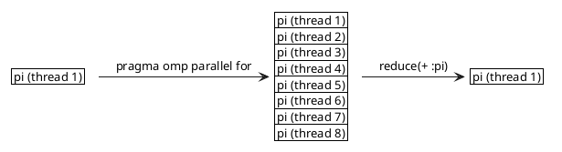

\newpage
# Explanation of the code

My code is all done in the main.cpp.
We can execute my code like this:
```bash
./build/tp4
```
Or like this, with the number of circumscribed rectangles given
```bash
./build/tp4 1000000
```
Or like this, with the number of circumscribed rectangles and the number of processor given
```bash
./build/tp4 1000000 16
```
The default number of threads used is 8 and the default number of circumscribed rectangles is $10^8$.


At the begining, I look after parameters, to set up the number of thread (stored in the variable 'n') and the number of circumscribed rectangles (stored in the variable 'nthread').

To change the default number of thread used, which is 8, I make:
```C++
omp_set_num_threads(nthread);
```
This function defined in 'omp.h' allow us to change the number of thread used to execute parallel sections of our code.

Then, I store the current time to compute at the end of the code the execution time like this:
```C++
// Begining of the code
double start = omp_get_wtime();
...
// End of the code
double end = omp_get_wtime();

// Print execution time:
cout << "Execution time: " << end - start << endl;
```
This function is also defined in 'omp.h' and give the current time in second, which is stored, in my case, in the variable 'start'.

I use a lambda expression to define the function $\frac{4}{1 + x^2}$. Here I put a 4 instead of a 1, because the integration of the function $\frac{1}{1 + x^2}$ in range [0, 1] give us an approximation of $\frac{\pi}{4}$, that's why I multiply the function $\frac{1}{1 + x^2}$ by 4 to compute directly an approximation of $\pi$. My lambda function looks like this:

```C++
auto f = [](double x) -> double {
	return 4./(1. + x * x);
};
```
This code means that the lambda function $f$ takes one parameter $x$ and return a double, which is the computation of the function $\frac{4}{1 + x^2}$ for the $x$ given.

Then, I compute the approximation of $\pi$ thanks to the sum of all surfaces of circumscribed rectangles. I use a for loop to make this, and I define the region as parallel region. My code looks like this:
```C++
#pragma omp parallel
{
	nthread = omp_get_num_threads();
	#pragma omp for reduction(+ :pi)
	for (int i = 1; i < n + 1; i++) {
		pi += delta * f(i*delta);
	}
}
```

We begin to define that we are in a parallel section of our code. The parallel section ends at the end of brackets: we have all our parallel section between the first '{' and the last '}'.
Then, we store in the variable nthread the number of thread which are in parallel section. This primitive give us the number of active threads, so if we don't call it in a parallel section, this primitive return just one because just one thread is active. That's why I call it in a parallel section.
Finally, we compute the approximation of $\pi$. We put `#pragma omp for reduction(+ :pi)` in our code to indicate that the for loop must be separed into the differents threads, and then when the threads have finished their part of the work, we want to make a sum of all the local result stored in pi for each thread, to have a result of pi which is the sum of every results obtained by each threads. In fact, `reduction(+ :pi)` say us that all the pi variable which have different result for each thread, must be added into the pi variable of the thread which will continue the program.
So we have something like this:

Finally we print all our results, with the number of circumscribed rectangles, the number of threads, the execution time and the approximation of $\pi$ obtained by our program.

# Explanation of the parallelization using OpenMP

To compute the approximation of $\pi$, we use parallelization using OpenMP.

The principe is that the code is executed by one thread. If we want to execute some section with multiple thread, we put
```C++
#pragma omp parallel
{
    // Parallel section here
}
```

and then, all the code between the brackets is executed with multiple thread. The number of thread used is defined thanks to the primitive
```C++
omp_set_num_threads(nthread);
```
We can get the number of thread used to execute a parallel section by calling the primitive below in the parallel section: 
```C++
int nthread = omp_get_num_threads();
```
This primitive return the number of threads active, so if we call this primitive outside a parallel section, we get just one thread because only one thread is active... That's why to have the number of thread used in a parallel section, we must call this primitive in a parallel section.

I used also the primitive `omp_get_wtime()` to get the current time and to compute the execution time at the end of the code, as explained in previous section.

The last primitive I used is:
```C++
#pragma omp for reduction(+ :pi)
```
This primitive take the datas to compute of the for loop and divide this work to the differents active threads, and then, thanks to `reduction`, the primitive add the results of all works into the variable pi.

# Presentation of the execution time results with varying thread counts.


# Graphs depicting the scaling of execution times.
# Observations and conclusions based on your findings.
