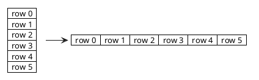
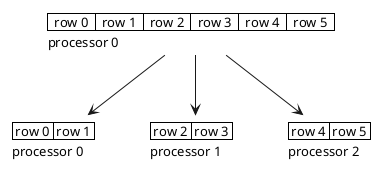
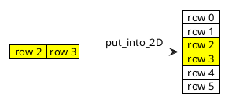
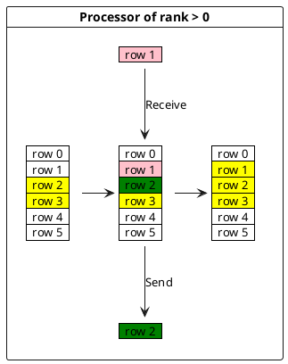
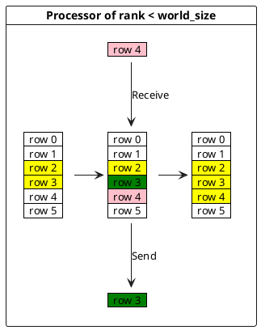
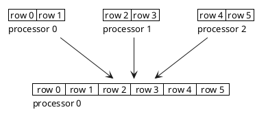
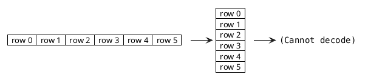

\newpage
# Explication du code

Mon code est composé d'un Makefile, d'un main.cpp contenant la fonction principale, d'un fichier grid.cpp et son header grid.h contenant les signatures des fonctions présentes dans
grid.cpp, et d'un fichier writer.cpp avec son header writer.h contenant la signature de la fonction définie dans writer.cpp.

## grid.cpp

Dans ce fichier se trouvent les fonctions utiles pour créer une grille 2D, convertir une grille 2D en grille 1D, convertir une grille 1D en grille 2D, afficher une grille, 
et enfin une dernière fonction appelée $put\_into\_2D$ prenant en paramètre une grille 2D et une grille 1D, avec le nombre de colonnes que représente cette grille 1D, 
le rang du processeur qui désire insérer la grille 1D dans la grille 2D, et la taille de la grille 2D. Cette fonction permet d'insérer une grille une dimension représentant une
ou plusieurs colonnes d'une grille 2D, et de les insérer dans la grille 2D suivant le rang du processeur... Par exemple, s'il s'agit du processeur 1, on va insérer notre grille 1D
à la position donnée par le nombre de colonnes fois le rang du processeur, donc ici le début de notre insertion se fera au nombre de colonnes de la grille.... À reformuler...

## main.cpp

Dans le main, on commence par initialiser l'environnement MPI par la commande
```cpp
MPI_Init(NULL, NULL);
```

Puis on collecte l'information du nombre de processeurs utilisé et du rang du processeur actuel
```cpp
// Get rank of processor
int rank = 0;
MPI_Comm_rang(MPI_COMM_WORLD, &rank);

// Get total number of processors
int world_size = 0;
MPI_Comm_size(MPI_COMM_WORLD, &world_size);
```
Puis, si on est le processeur 0, on prend le temps à l'état initial grâce à l'appel à la fonction $MPI\_Wtime()$ qui nous donne le temps en seconde lors de son appel, et à la fin de notre code, on prend le temps et on compare avec le temps initial pour obtenir le temps d'exécution de notre code:
```cpp
// Begining of the code
double start = 0;
if (rank == 0) {
    start = MPI_Wtime();
}
...
// End of the code
if (rank == 0) {
    double end = MPI_Wtime();
    cout << end - start << endl;
}
```
Ensuite, on prend notre grille 2D, on vérifie que son nombre de colonnes est divisible par le nombre de processeurs utilisés dans notre problème par:
```cpp
if (size % world_size != 0) return -1;
```

Puis on crée une grille 2D, et on la converti en grille 1D grâce aux fonctions définies dans grid.cpp.
```cpp
vector<vector<double>> grid = create_grid(size);
vector<double> grid_line = convert_to_1D(grid, size);
```
Voici notre grille créée. Ici, pour mes représentations, je vais estimer que les processeurs vont travailler avec notre grille découpée en lignes, car comme notre grille est carrée, travailler avec des lignes est exactement la même chose que travailler avec des colonnes.


Ce qui nous donne la grille précédente en ligne:


Enfin, on va découper notre grille linéaire en N grilles linéaires plus petites en utilisant la primitive Scatter de MPI qui prend en paramètre un vecteur 1 dimension et qui va le diviser en N vecteurs de dimension donnée dans MPI, avec N le nombre de processeurs utilisés. Cela nous donne:
```cpp
MPI_Scatter(
    grid_line.data(),       // Data to split
    nb_columns * size,      // Size of a split
    MPI_DOUBLE,             // Data type
    recvbuf.data(),         // Destination of a split
    nb_columns * size,      // Size of destination
    MPI_DOUBLE,             // Data type of destination
    0,                      // Rank of processor which split datas
    MPI_COMM_WORLD);        // Communicator between processors
```

Ensuite, on va prendre la donnée reçue et on va la réinsérer dans la grille 2D car la grille a été créée et c'est possible de la réutiliser pour ensuite calculer plus facilement l'équation de chaleur pour chaque élément donné grâce à la formule de l'équation de chaleur.

```cpp
grid = put_into_2D(grid, recvbuf, nb_columns, rank, size);
```


Si on n'est pas le premier processeur, on envoie notre première ligne au processeur de rang inférieur, et on reçoit de ce processeur sa dernière ligne.
```cpp
if (rank > 0) {
		MPI_Isend(
            grid[rank * nb_columns].data(),     // Data to send
            size,                               // Size of data
            MPI_DOUBLE,                         // Type of data
            rank - 1,                           // Rank of processor which receive data
            0,                                  // Tag
            MPI_COMM_WORLD,                     // Communicator
            &top_request                        // Communication request
        );
		MPI_Irecv(
            grid[rank * nb_columns - 1].data(), // buffer to receive data
            size,                               // Size of buffer
            MPI_DOUBLE,                         // Type of data
            rank - 1,                           // Rank of processor which send data
            0,                                  // Tag
            MPI_COMM_WORLD,                     // Communicator
            &top_request                        // Communication request
        );
}
```


Si on n'est pas le dernier processeur, on envoie notre dernière ligne au processeur de rang supérieur, et on reçoit de ce processeur sa première ligne.
```cpp
if (rank < world_size - 1) {
		MPI_Isend(
            grid[(rank + 1) * nb_columns - 1].data(),   // Data to send
            size,                                       // Size of data
            MPI_DOUBLE,                                 // Type of data
            rank + 1,                                   // Rank of processor which receive data
            0,                                          // Tag
            MPI_COMM_WORLD,                             // Communicator
            &bottom_request                             // Communication request
        );                                                                       
		MPI_Irecv(                                                               
            grid[(rank + 1) * nb_columns].data(),       // buffer to receive data
            size,                                       // Size of buffer
            MPI_DOUBLE,                                 // Type of data
            rank + 1,                                   // Rank of processor which send data
            0,                                          // Tag
            MPI_COMM_WORLD,                             // Communicator
            &bottom_request                             // Communication request
        );
}
```

Ensuite, on attend que les échanges soient finis par ces lignes de code:

```cpp
if (rank > 0) {
	MPI_Wait(&top_request, MPI_STATUS_IGNORE);
}
if (rank < world_size - 1) {
	MPI_Wait(&bottom_request, MPI_STATUS_IGNORE);
}
```
Enfin, on calcule notre équation de chaleur, qu'on met dans un vecteur ligne, afin de préparer la réunion des données. Pour calculer l'équation de chaleur, j'ai repris la formule donnée. J'ai simplement fait en sorte que chacun des processeurs calcule uniquement les lignes qui lui ont été attribué: 
```cpp
for (int i=rank*nb_columns;i<rank*nb_columns + nb_columns;i++)
```
Pour ne pas calculer les bords, j'ai ajouté une condition demandant de ne pas calculer l'équation si on se trouve sur le bord de la grille.

```cpp
if (i == 0 || j == 0 || j == size - 1 || i == size - 1) recvbuf[n] = grid[i][j];
```

Enfin, maintenant que chacun des processeur a calculé sa part de l'équation de chaleur et stocké le tout dans une grille 1 dimension, on réuni tous les calculs effectués dans un vecteur ligne grâce à un Gather. Cela s'exprime par cette ligne de code:
```cpp
MPI_Gather(
    recvbuf.data(),         // Buffer of data to merge
    nb_columns * size,      // Size of buffer
    MPI_DOUBLE,             // Type of data
    grid_line.data(),       // Destination of all datas
    nb_columns * size,      // Size of a split
    MPI_DOUBLE,             // Type of data
    0,                      // Root processor which collect data
    MPI_COMM_WORLD          // Communicator
);
```
Ce qui, graphiquement, nous donne:

Et maintenant que nous avons récupéré toutes les données sous forme d'un vecteur ligne (toutes les données sont récupérées dans le processeur 0), on peut transformer ce vecteur ligne en une grille 2D grâce à la fonction $convert\_to\_2D$ définie dans le fichier grid.cpp si on est le processeur 0, et ensuite créer une image bmp à partir des données contenues dans la grille.
```cpp
grid = convert_to_2D(grid_line, grid, grid.size());
write_to_bmp(
    size, // Size of the grid
    grid, // The grid to use
    time, // The iteration (just used to name the file of the output image)
    *min_element(grid_line.begin(), grid_line.end()), // Get min of the grid
    *max_element(grid_line.begin(), grid_line.end())  // Get max of the grid
);
```

## Makefile
Voici à quoi ressemble mon Makefile:
```Makefile
CC = mpic++
CFLAGS = -g -Wall -c
OBJS = grid.o writer.o
.PHONY = clean cleanbmp

tp3: main.cpp $(OBJS)
	$(CC) $(OBJS) main.cpp -o tp3

grid.o: grid.cpp
	$(CC) $(CFLAGS) grid.cpp -o grid.o

writer.o: writer.cpp
	$(CC) $(CFLAGS) writer.cpp -o writer.o

clean:
	rm $(OBJS) tp3

cleanbmp:
	rm T_*

cleanoutput:
	rm ./err/* ./out/*
```
J'ai ajouté une méthode cleanbmp pour supprimer toutes les images que j'ai généré par mon programme, ainsi qu'une méthode cleanoutput pour supprimer tous les fichiers que j'ai créé dans baobab.

## Run.sh

\newpage
# Tests et discussion sur les résultats obtenus

Tout d'abord, voici les résultats obtenus pour $10^0, 10^1, 10^2, 10^3, 10^4$ et $10^5$ itérations pour une grille de taille $128\times 128$. J'ai ici donné le temps d'exécution sur baobab et sur ma machine (donc local time), avec 4 processeurs car ma machine ne possède que 4 coeurs:

```plantuml
@startuml

<style>
note {
    backgroundcolor white
    linecolor transparent
}
</style>

note as im0
    <img:/home/darcy/Documents/parallelism/heastSeq/img_0001.png>
    iterations: 1
    local time: 0.00273787 s
    baobab time: 0.0995883 s
end note

note as im1
    <img:/home/darcy/Documents/parallelism/heastSeq/img_0010.png>
    iterations: 10
    local time: 0.00925136 s
    baobab time: 0.102747 s
end note

note as im2
    <img:/home/darcy/Documents/parallelism/heastSeq/img_0100.png>
    iterations: 100
    local time: 0.0427147 s
    baobab time: 0.138363 s
end note

im0 -> im1
im1 -> im2
@enduml
```

```plantuml
@startuml

<style>
note {
    backgroundcolor white
    linecolor transparent
}
</style>
note as im3
    <img:/home/darcy/Documents/parallelism/heastSeq/img_1000.png>
    iterations: 1000
    local time: 0.378882 s
    baobab time: 0.492121 s
end note

note as im4
    <img:/home/darcy/Documents/parallelism/heastSeq/img_10000.png>
    iterations: 10000
    local time: 9.84631 s
    baobab time: 4.01674 s
end note

note as im5
    <img:/home/darcy/Documents/parallelism/heastSeq/img_100000.png>
    iterations: 100000
    local time: 105.119 s
    baobab time: 39.3161 s
end note

im3 -> im4
im4 -> im5
@enduml
```




En observant les résultats, nous pouvons observer des choses intéressantes:
- le temps d'exécution sur ma machine est plus rapide que le temps d'exécution sur baobab pour un nombre d'itérations inférieur ou égal à 1000. Je pense que cela est dûe à la communication entre les processeurs: sur baobab,  les processeurs ne sont pas forcément sur le chip, tandis que dans mon ordinateur, les processeurs sont sur un même chip, donc la communication inter processeur est très rapide, contrairement à baobab. Par contre, baobab possède des processeurs plus puissant que les miens. En effet, mes processeurs doivent avoir une fréquence d'horloge de 2 GHz tandis que sur baobab, on doit plutôt être à 4 GHz car pour un gros calcul où les temps de communications deviennent négligeable, baobab est plus rapide.

## Exécution sur baobab

J'ai exécuté mon programme sur baobab en variant plusieurs paramètes (taille de la grille, itérations, nombre de processeurs...)
J'ai ensuite récupéré les données du temps d'exécution afin d'afficher des graphes que j'ai fait avec python.
Voici différents résultats que j'ai obtenu:
\newpage


```plantuml
@startuml
<style>
note {
    backgroundcolor white
    linecolor transparent
}
</style>
note as im1
    <img:/home/darcy/Documents/parallelism/heastSeq/graph/Size_64.png>
end note
note as im2
    <img:/home/darcy/Documents/parallelism/heastSeq/graph/Size_128.png>
end note

im1 -[hidden]r-> im2
@enduml
```

On peut constater que nous avons de grandes différences sur les temps d'exécutions pour un nombre élevé d'itérations, mais que sinon, les temps d'exécutions sont très proches. Cela est dû au fait que pour un nombre faible d'itérations, le temps de communication entre processeurs n'est pas négligeable, ce qui égalise les exécutions où on n'a pas beaucoup de processeurs, qui doivent alors calculer plus, et où on a beaucoup de processeurs, qui passent un temps non négligeable à se transmettre les informations.

C'est pour cela qu'on a décidé de prendre un nombre d'itérations élevé de $10^5$ pour avoir un temps de communication entre processeur négligeable comparé au temps de calcul.

Voici le graphe que j'obtiens pour un nombre fixé d'itérations:


On peut remarquer que pour des petites grilles, le temps de calcul ne varie plus à partir de 8 processeurs...


