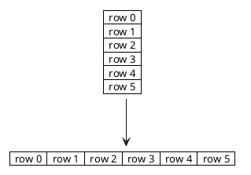
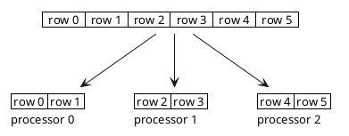
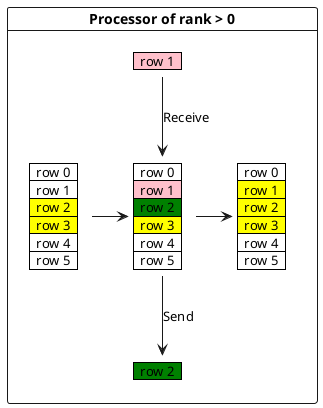
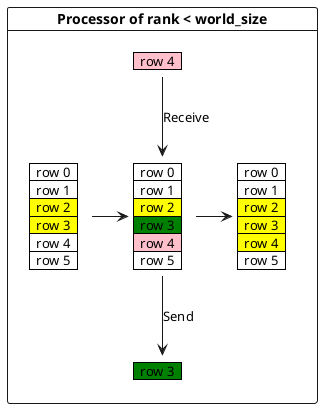

# Explication du code

Mon code est composé d'un Makefile, d'un main.cpp contenant la fonction principale, d'un fichier grid.cpp et son header grid.h contenant les signatures des fonctions présentes dans
grid.cpp, et d'un fichier writer.cpp avec son header writer.h contenant la signature de la fonction définie dans writer.cpp.

## grid.cpp

Dans ce fichier se trouvent les fonctions utiles pour créer une grille 2D, convertir une grille 2D en grille 1D, convertir une grille 1D en grille 2D, afficher une grille, 
et enfin une dernière fonction appelée $put\_into\_2D$ prenant en paramètre une grille 2D et une grille 1D, avec le nombre de colonnes que représente cette grille 1D, 
le rang du processeur qui désire insérer la grille 1D dans la grille 2D, et la taille de la grille 2D. Cette fonction permet d'insérer une grille une dimension représentant une
ou plusieurs colonnes d'une grille 2D, et de les insérer dans la grille 2D suivant le rang du processeur... Par exemple, s'il s'agit du processeur 1, on va insérer notre grille 1D
à la position donnée par le nombre de colonnes fois le rang du processeur, donc ici le début de notre insertion se fera au nombre de colonnes de la grille.... À reformuler...

## main.cpp

Dans le main, on commence par initialiser l'environnement MPI par la commande
```cpp
MPI_Init(NULL, NULL);
```

Puis on collecte l'information du nombre de processeurs utilisé et du rang du processeur actuel
```cpp
// Get rank of processor
int rank = 0;
MPI_Comm_rang(MPI_COMM_WORLD, &rank);

// Get total number of processors
int world_size = 0;
MPI_Comm_size(MPI_COMM_WORLD, &world_size);
```


Ensuite, on prend notre grille 2D, on vérifie que son nombre de colonnes est divisible par le nombre de processeurs utilisés dans notre problème par:
```cpp
if (size % world_size != 0) return -1;
```

Puis on crée une grille 2D, et on la converti en grille 1D grâce aux fonctions définies dans grid.cpp.
```cpp
vector<vector<double>> grid = create_grid(size);
vector<double> grid_line = convert_to_1D(grid, size);
```
Voici notre grille créée. Ici, pour mes représentations, je vais estimer que les processeurs vont travailler avec notre grille découpée en lignes, car comme notre grille est carrée, travailler avec des lignes est exactement la même chose que travailler avec des colonnes.


Ce qui nous donne la grille précédente en ligne:


Enfin, on va découper notre grille linéaire en N grilles linéaires plus petites en utilisant la primitive Scatter de MPI qui prend en paramètre un vecteur 1 dimension et qui va le diviser en N vecteurs de dimension donnée dans MPI, avec N le nombre de processeurs utilisés. Cela nous donne:
```cpp
MPI_Scatter(
    grid_line.data(),
    nb_columns * size,
    MPI_DOUBLE,
    recvbuf.data(),
    nb_columns * size,
    MPI_DOUBLE,
    0,
    MPI_COMM_WORLD);
```

Ensuite, on va prendre la donnée reçue et on va la réinsérer dans la grille 2D car la grille a été créée et c'est possible de la réutiliser pour ensuite calculer plus facilement l'équation de chaleur pour chaque élément donné grâce à la formule de l'équation de chaleur.

```cpp
grid = put_into_2D(grid, recvbuf, nb_columns, rank, size);
```


```plantuml
@startuml
skinparam ClassFontSize 11
<style>
note {
    backgroundcolor white
    shadowing 0
    linecolor transparent
}
</style>
note as element
    <#yellow>|  row 2  | row 3 |
end note
note as grid
    |  row 0  |
    |  row 1  |
    <#yellow>|  row 2  |
    <#yellow>|  row 3  |
    |  row 4  |
    |  row 5  |
end note

element --> grid : "put_into_2D"


@enduml
```

Si on n'est pas le premier processeur, on envoie notre première ligne au processeur de rang inférieur, et on reçoit de ce processeur sa dernière ligne.
```cpp
if (rank > 0) {
		MPI_Isend(
            grid[rank * nb_columns].data(),
            size,
            MPI_DOUBLE,
            rank - 1,
            0,
            MPI_COMM_WORLD,
            &top_request
        );
		MPI_Irecv(
            grid[rank * nb_columns - 1].data(),
            size,
            MPI_DOUBLE,
            rank - 1,
            0,
            MPI_COMM_WORLD,
            &top_request
        );
}
```


Si on n'est pas le dernier processeur, on envoie notre dernière ligne au processeur de rang supérieur, et on reçoit de ce processeur sa première ligne.
```cpp
if (rank < world_size - 1) {
		MPI_Isend(
            grid[(rank + 1) * nb_columns - 1].data(),
            size,
            MPI_DOUBLE,
            rank + 1,
            0,
            MPI_COMM_WORLD,
            &bottom_request
        );
		MPI_Irecv(
            grid[(rank + 1) * nb_columns].data(),
            size,
            MPI_DOUBLE,
            rank + 1,
            0,
            MPI_COMM_WORLD,
            &bottom_request
        );
}
```

Ensuite, on attend que les échanges soient finis par ces lignes de code:

```cpp
if (rank > 0) {
	MPI_Wait(&top_request, MPI_STATUS_IGNORE);
}
if (rank < world_size - 1) {
	MPI_Wait(&bottom_request, MPI_STATUS_IGNORE);
}
```
Enfin, on calcule notre équation de chaleur, qu'on met dans un vecteur ligne, afin de préparer la réunion des données. Pour calculer l'équation de chaleur, j'ai repris la formule donnée. J'ai simplement fait en sorte que chacun des processeurs calcule uniquement les lignes qui lui ont été attribué: 
```cpp
for (int i=rank*nb_columns;i<rank*nb_columns + nb_columns;i++)
```
Pour ne pas calculer les bords, j'ai ajouté une condition demandant de ne pas calculer l'équation si on se trouve sur le bord de la grille.

```cpp
if (i == 0 || j == 0 || j == size - 1 || i == size - 1) recvbuf[n] = grid[i][j];
```

Enfin, maintenant que chacun des processeur
