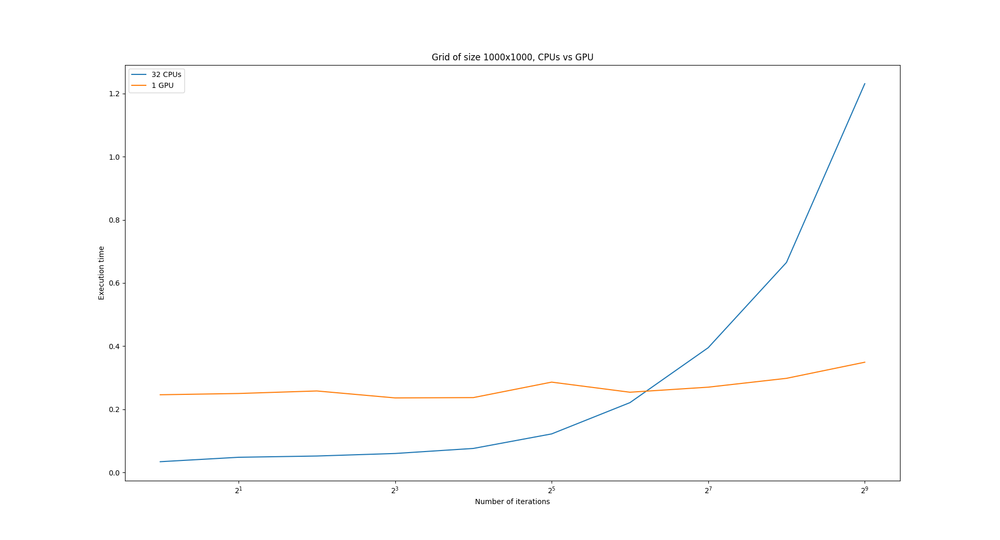

\newpage

# Introduction

Dans ce travail pratique, notre but est de paralléliser l'équation de chaleur en utilisant la librairie standard de parallélisation d'algorithmes de C++.
Cela nous permettra de faire tourner notre code sur des CPUs, mais également sur des GPUs.


# Méthodologie

Mon code est divisible en trois parties:

La première partie consiste simplement à prendre les options de l'utilisateur et à initialiser les variables utiles pour la suite de l'exécution du code.

La deuxième partie consiste à calculer l'équation de chaleur pour chaque élément de la grille.

Et la troisième partie consiste à afficher les résultats de l'exécution de mon code et à enregistrer dans un fichier `.bmp` la visualisation du résultat obtenu.
Pour obtenir la visualisation du résultat obtenu, j'ai simplement repris la fonction donnée dans le travail pratique numéro 3, que j'ai légèrement modifié.

En effet, la fonction donnée dans le travail pratique 3 prennait en argument un vecteur 2 dimensions, et dans mon code j'utilise uniquement des vecteurs 1 dimension pour avoir quelque chose de continu dans la mémoire.
C'est pourquoi j'ai modifié la fonction pour qu'elle prenne en argument un vecteur 1 dimension.
Pour cela, j'ai simplement effectué ce changement:
```C++
// Before
double value = ((data[iX][iY] - minval) / (maxval - minval));

// After
double value = ((data[iY * N + iX] - minval) / (maxval - minval));
```
Je calcule le temps d'exécution de mon programme au moyen de la librairie C++ `chrono` de la manière suivante:
```C++
// Begin of the program
// Get the time
auto start_time = std::chrono::high_resolution_clock::now();
...
// End of the program
// Get the time
auto end_time = std::chrono::high_resolution_clock::now();

// Calculate execution time
auto execution_time = std::chrono::duration_cast<std::chrono::milliseconds>(end_time - start_time);
```


Pour initialiser et afficher une grille, j'ai utilisé des lambdas fonctions.
La fonction pour afficher la grille m'a servi uniquement pour tester si la fonction qui s'occupe de créer et d'initialiser la grille le faisait correctement.
Pour effectuer mon test, j'ai simplement créé une grille de taille 10 x 10 et j'ai regardé si le résultat était bien ce que j'attendais, ce qui est le cas.

Dans mon code, j'utilise 2 grilles: l'une me sert à stocker le résultat de l'équation de chaleur, et l'autre me sert à calculer l'équation de chaleur.

Je dois avoir des vecteurs une dimension pour que les données soient continues en mémoire, afin de pouvoir utiliser un `for_each` dans la suite de mon code.
C'est pourquoi, j'ai défini 3 fonctions qui permettent d'accéder aux éléments d'un vecteur une dimension comme si c'était un vecteur 2 dimensions et vice versa.
J'ai dû définir ces 3 fonctions comme étant `inline` car sinon elles auraient été définies sur la pille et lorsqu'on exécute le code sur par exemple un GPU, celui-ci n'a pas accès à la pille, donc n'aurait pas eu accès à ces fonctions nécessaires au bon déroulement du code.
Le `inline` permet simplement de copier la fonction lorsqu'elle apparaît, comme cela le code fonctionne sur CPU et sur GPU n'ayant pas accès à la pille, car la fonction est copié dans le GPU.
J'ai donc défini les fonctions `i2x` et `i2y` permettant de convertir l'index d'un vecteur unidimentionnel en index `x` et `y` d'un vecteur bidimensionnel, et la fonction `xy2i` permettant de convertir les index `x` et `y` d'un vecteur bidimensionnel en index unidimensionnel pour un vecteur unidimensionnel.

Le coeur de mon programme se passe dans ces lignes de code:
```C++
for(int iT = 0; iT < max_iter;iT++) {
	for_each(std::execution::par_unseq, grid_2.begin(), grid_2.end(),
		[start = grid_2.data(), size, grid = grid.data(), diagx, diagy, weightx, weighty](double& item) {
			int index = &item - start;
			int x = i2x(index, size);
			int y = i2y(index, size);
			if (x == 0 || y == 0 || x == size - 1 || y == size - 1)
				item = *(grid + index);
			else
				item = weightx*(*(grid + xy2i(x-1, y, size))
				+ *(grid + xy2i(x+1, y, size))
				+ *(grid + xy2i(x, y, size)) * diagx)
				+ weighty * (*(grid + xy2i(x, y-1, size))
				+ *(grid + xy2i(x, y+1, size))
				+ *(grid + xy2i(x, y, size))*diagy);
		});

	swap(grid_2, grid);
}
```

La boucle for me permet de calculer l'équation de chaleur pour le nombre d'itérations demandé.

Le `for_each` s'utilise de la manière suivante:
```C++
void for_each(execution_policy,Iter first, Iter end, [cap](){lamda body });
```

Dans mon code, j'ai défini la politique d'exécution comme étant `std::execution::par_unseq`, ce qui indique que le `for_each` devra s'exécuter en parallèle.

On a trois principaux types de politique d'exécution défini en C++:

-`std::execution::seq` indiquant que le code ne doit pas être exécuté en parallèle, ce qui est donné par défaut dans `for_each`
-`std::execution::par_unseq` indiquant que le code peut s'exécuter dans n'importe quel thread et dans n'importe quel ordre. Le code peut alors être parallélisé, vectorisé ou migré entre les threads.
-`std::execution::par` indiquant que le code peut être exécuté en parallèle soit dans le thread appelant, soit dans un autre thread créée pour prendre en charge l'exécution du code parallèle.

Comme on désire pouvoir utiliser autant de threads que l'on veut, on utilise `par_unseq` car cela permet au code d'être exécuté dans n'importe quel thread et dans n'importe quel ordre, car pour calculer le nouvel état de la grille, qui est stocké lors de son calcul dans `grid_2`, on a seulement besoin de l'ancien état de la grille, qui est stocké dans `grid` et qui n'est pas modifié pendant tout le calcul de `grid_2`, ce qui signifie que nous n'avons pas de problème de concurrence.
Un problème de concurrence est donné si, par exemple, deux threads voulaient écrirent en même temps au même endroit dans la mémoire...

Ensuite, grâce à la librairie `algorithm` de C++, on a 'convertit' notre vecteur `grid_2` en itérateurs.
Cela a pu être possible car il s'agit d'un vecteur unidimensionnel, qui est donc continu en mémoire.
`grid_2.begin()` et `grid_2.end()` indiquent où commencer à itérer dans la mémoire et où s'arrêter d'itérer.

Enfin, le dernier paramètre passé à la fonction est une lambda fonction qui va s'appliquer à chaque élément compris entre l'itérateur de début et l'itérateur de fin.
Il s'agit dans mon code du calcul de l'équation de chaleur que l'on veut appliquer à chaque élément de la grille.

La lambda fonction commence par prendre entre `[` et `]` toute les dépendances avec le reste du code.
On indique alors qu'on veut que celle-ci capture l'adresse du premier élément de notre vecteur unidimensionnel dans la variable `start` par `start = grid_2.data()`, qui crée un nouveau pointeur `start` pointant sur le premier élément du vecteur.
Pour le vecteur `grid`, on le passe également par valeur à la fonction par `grid = grid.data()`, ce qui va copier le vecteur et permettre de l'utiliser dans, par exemple, un gpu qui n'a pas accès à la pile.
Si on mettait uniquement `grid`, on passerait le vecteur par référence et on pourrait l'utiliser dans des cpus, mais pas dans des gpus car ceux-ci n'ont pas accès à la pile des cpus.
Le vecteur `grid` donne le dernier état de notre grille, donc on en a besoin dans l'équation de chaleur pour calculer l'état suivant de la grille.
On indique également qu'on veut que la lambda fonction capture les valeurs définies précédement, comme par exemple `size`, `diagx`, etc.

Puis la lambda fonction prend dans les parenthèses l'élément donné par l'itération du `for_each`, ce qui dans notre cas correspond à l'élément `i` du vecteur unidimensionnel `grid_2`.

Dans le corps de la fonction, on commence par obtenir l'index de l'élément actuel que l'on veut calculer en soustrayant l'adresse mémoire de l'élément actuel avec l'adresse mémoire du premier élément de notre vecteur (obtenu dans la variable `start`), ce qui fonctionne grâce au fait que les données sont continues en mémoire car on a un vecteur unidimensionnel.

Puis, une fois que l'on possède cette indication, on convertit cet index en coordonnées `x` et `y` d'un vecteur bidimensionnel au moyen des fonctions `inline` définies précédement, afin de traîter l'équation de chaleur comme si on travaillait avec une grille bidimensionnel.
Grâce à ces coordonnées obtenues, on commence par vérifier que l'on ne se trouve pas au bord de la grille.
Si on est au bord de la grille, on n'effectue aucun calcul, sinon, on effectue le calcul de l'équation de chaleur.

Notez que pour accéder aux éléments de notre vecteur `grid`, comme on possède le pointeur sur le premier élément, on accède toujours à la valeur stocké à l'adresse `grid + index`, qui correspond à la valeur stockée dans `grid[index]`...
On stocke le résultat dans l'élément item, qui correspond à l'élément `grid_2[index]`.

Le `swap` permet de mettre à jour `grid` pour que ce vecteur contienne toujours le dernier état de la grille.

Enfin, on écrit le dernier état de la grille obtenu dans un fichier `.bmp` afin de pouvoir visualiser le résultat obtenu.

\newpage

# Résultats

J'ai exécuté mon code sur baobab au moyen de 2 scripts bash, l'un s'appelant `runcpu.sh` et l'autre s'appelant `rungpu.sh`, permettant d'exécuter le code respectivement sur 32 cpus et sur 1 gpu.
J'ai fait varier la taille de mon domaine de $10^2$ à $10^5$ et le nombre d'itérations de $2^0$ à $2^9$.
J'ai ensuite créé des graphiques à l'aide de python avec les données obtenues.

Voici les graphiques que j'ai obtenu:





# Discussion

J'ai eu beaucoup de difficultés à faire tourner mon code sur baobab.
Faire tourner le code avec de nombreux cpus, je savais faire, mais pas avec un gpu.
J'ai alors compris que je devais mettre dans mon script `#SBATCH gpus 1` au lieu de `#SBATCH cpus-per-task 32`.
Ainsi, en changeant également la partition utilisée, mon code pouvait accéder à 1 gpu.
Ensuite, la commande `nvc++` était introuvable pour compiler le code.
J'ai fait appel à l'assistant qui a résolu le problème en me demandant de changer ces lignes:
```bash
// Before
module load foss/2020b
module load CUDA

// After
module load foss/2018.b
module load NVHPC/21.9
```

Puis j'ai dû modifier mon code car au début j'avais passé par référence le vecteur `grid` dans le `for_each`, ce qui faisait que le gpu n'avait pas accès aux données du vecteur.
Les modifications de mon code m'ont alors fait passer par valeur le vecteur `grid`.

Voici le ratio que j'ai obtenu pour le temps d'exécution sur 1 GPU comparé au temps d'exécution sur 32 CPUs (J'ai appliqué la formule suivante: temps d'exécution sur CPU divisé par temps d'exécution sur GPU):


Nous pouvons alors remarqué que pour une grille de taille 100 x 100, le ratio obtenu est très faible.
En effet, lorsque l'on observe le temps d'exécution de nos CPUs, on voit que celui-ci est très faible par rapport au temps d'exécution sur GPU.
Ceci est normal, car le problème est de petite taille, et selon la loi d'Amdahl, pour un problème fixé, on voit que la parallélisation n'est pas très utile.
Donc utiliser un GPU qui possède des milliers d'unité de calcul à basse fréquence est moins bien que d'utiliser quelques CPUs à haute fréquence.
D'autant plus qu'il faut transmettre les données au GPU, ce qui prend un temps non négligeable pour un petit problème.

Cependant, lorsque l'on augmente la taille du problème, en augmentant la taille du domaine, on peut observer que le ratio augmente considérablement...
On a à peu près fait fois 10 le ratio entre GPU et CPU lorsqu'on a multiplié la taille de notre domaine par 10.
On peut alors observer que le GPU possède un temps d'exécution assez constant, comparé au temps d'exécution sur CPUs qui a tendance à augmenter rapidement.
Cela vérifie la loi de Gustafson, disant que plus le nombre d'unités de calcul augmente, plus le travail peut être conséquent.
En effet, en augmentant la taille de notre problème, on donne du travail à des milliers d'unité de calcul du GPU qui travaillent à plus basse fréquence que les 32 CPUs, mais qui ont l'avantage d'être plus nombreuses que les 32 CPUs.
Le temps d'exécution est à peu près constant (et d'ailleurs équivalent au temps d'exécution obtenu pour une grille de taille 100x100 car on est toujours à 0.2 secondes de temps d'exécution), car on peut encore augmenter la taille du problème: toutes les unités de calcul du GPU n'ont pas encore eu à travailler, contrairement aux 32 CPUs qui ont un temps d'exécution augmentant considérablement.
Le temps d'exécution sur GPU est alors 3 fois meilleur que le temps d'exécution sur CPU, comme nous pouvons le voir sur le graphique nous montrant les ratios des temps d'exécution.

Enfin, pour un problème de taille $10^4$, on peut observer des choses intéressantes:
plus la taille du problème augmente et plus le temps d'exécution sur CPU augmente, alors que le temps d'exécution sur GPU reste à peu près constant.
C'est toujours parce que le GPU n'a pas reçu de travail suffisamment important pour occuper toutes ses unités de calcul.
Mais en revanche, on peut remarquer que à partir de 128 itérations, le temps d'exécution sur GPU commence également légèrement à augmenter...
On commence donc à avoir donné un travail suffisamment grand pour que toutes les unités de calcul soient occupées.
Le temps d'exécution sur GPU est alors 8 fois meilleur que le temps d'exécution sur CPU.
Cependant, on peut observer que pour un nombre d'itérations élevé, le temps d'exécution sur GPU commence à suivre la courbe du temps d'exécution sur CPUs, mais augmente plus doucement.
On peut également remarquer que le ratio entre le temps d'exécution sur CPU et le temps d'exécution sur GPU commence à ne plus augmenter autant...
Cela signifierait qu'on commencerait à atteindre un seuil, et que le ratio se stabiliserait à une valeur maximale.
Le ratio ne va donc pas croître indéfiniment, mais il va se stabiliser, ce qui vérifie la loi d'Amdahl indiquant que pour un travail fixé, la parallélisation du problème permettra de gagner des performances jusqu'à un certain seuil...
Il faudrait alors modifier la puissance de calcul pour modifier le ratio

# Conclusion

Donc pour un petit problème donné, exécuter le problème sur un GPU ne va pas nous permettre de gagner des performances, car toutes les unités du GPU ne travailleront pas et il y aura beaucoup d'overhead, faisant un temps d'exécution constant.
Donc pour un petit problème donné, exécuter le problème sur un CPU qui possède une plus grande fréquence d'horloge que les unités de calcul d'un GPU permettra d'avoir un temps d'exécution meilleur.

Mais plus on augmente la taille du problème, plus cela devient intéressant d'exécuter le problème sur un GPU car ses unités de calcul vont être utilisés et comme un GPU possède des milliers d'unités de calcul, le temps d'exécution sur GPU va devenir meilleur que le temps d'exécution sur CPU.
Cela vérifie la loi de Gustafson disant que plus le nombre d'unités de calcul augmente, plus on peut résoudre des gros problèmes.

Enfin, à un moment donné, la taille du problème est suffisamment importante pour utiliser toutes les unités de calcul du GPU, ce qui fait que le ratio du temps d'exécution sur GPU et sur CPU atteint une limite, ce qui vérifie la loi d'Amdahl indiquant que pour un problème fixé, la parallélisation permettra de gagner des performances jusqu'à un certain seuil.

Donc pour un problème donné, plusieurs défis sont à relever:

1. Réussir à paralléliser le plus possible le problème
2. Paralléliser le problème pour pouvoir également le faire tourner sur un GPU
3. Trouver le juste milieu entre GPU et CPU afin de minimiser le temps d'exécution du problème
