\newpage

# Introduction

L'objectif de ce travail pratique est de réutiliser le code parallélisé permettant de calculer l'ensemble de Mandelbrot, créé lors du travail pratique précédent, de sélectionner 2 régions de l'ensemble de Mandelbrot, de faire varier l'ordonnanceur entre statique et dynamique, ainsi que sa granularité pour les 2 régions choisies, et d'analyser les résultats obtenus.

Un ordonnanceur permet d'indiquer comment distribuer les itérations d'une boucle aux threads actifs.
Les itérations sont regroupées en blocs avant d'être distribuées aux différents threads.
La granularité de l'ordonnanceur donne le nombre d'itérations par bloc.

Dans le travail pratique, on va étudier les avantages et désavantages des ordonnanceurs statiques et dynamiques.
Un ordonnanceur statique attribue les blocs entre les threads au moment de la compilation.
Un ordonnanceur dynamique attribue les blocs entre les threads au moment de l'exécution.

# Méthodologie

Voici la structure de mon code:


```shell
├── graph.py
├── Makefile
├── rapport.md
├── rapport.pdf
├── run.sh
└── src
    ├── dynamic.cpp
    ├── static.cpp
    ├── writer.cpp
    └── writer.hpp

```

Il y a un code qui permet de faire uniquement de l'ordonnancement statique (car cela se fait à la compilation) et un autre code qui permet de faire uniquement de l'ordonnancement dynamique (qui se fait à l'exécution).

Lorsque l'on compile le code, on a tp6 qui est notre exécutable, et le résultat de notre fractal est enregistré dans un fichier `.bmp`, qui possède dans son nom le nombre d'itérations utilisé.
J'ai réutilisé le writer.cpp du travail pratique 3 afin de créer le fichier `.bmp` pour visualiser le résultat obtenu.

Mon code est presque le même que le code rendu au travail pratique précédent. C'est pourquoi, je vais uniquement expliquer les changements, et les grandes parties de mon code.

Mon code est divisible en 3 parties. Une première partie permettant de gérer les options données par l'utilisateur, une seconde partie permettant de calculer l'ensemble de Mandelbrot en section parallèle, et une dernière partie consistant à enregistrer dans un fichier `.bmp` les résultats obtenus, et à afficher le temps d'exécution, et d'autres informations, comme le nombre de threads utilisé, le type d'ordonnanceur utilisé...

On peut donner comme option le nombre d'itérations.
```bash
./tp6 -i 256
```
On peut donner comme option le nombre de threads actifs en section parallèle.
```bash
./tp6 -n 16
```
On peut donner comme option les coordonnées du `top left` (`tl`) et du `bottom right` (`br`) de la vue de notre fractal.
```bash
./tp6 -c -1 -1 1 1
```
On peut donner comme option le type d'ordonnanceur et la taille d'une section du travail donné aux threads.
Si on veut un ordonnanceur statique, on donne `-s`, sinon, on donne `-d` pour un ordonnanceur dynamique.
```bash
./tp6 -s 2 # For static shedule
./tp6 -d 2 # For dynamic shedule
```
Enfin, on peut afficher une aide:
```bash
./tp6 -h
Usage: ./tp6
	-i [iterations]
	-n [number of threads]
	-c [tl_x tl_y br_x br_y]
	-s [chunk_size] (for static schedule)
	-d [chunk_size] (for dynamic schedule)
```

Si on donne aucun paramètre, le nombre d'itérations par défaut est 256, et la vue par défaut de notre fractal est `tl(0.3475, 0.3475)` et `br(0.36, 0.36)`.
Le nombre par défaut de thread est donné par notre machine. L'ordonnanceur par défaut est dynamique et possède une granularité `chunk_size` de taille 1.

On peut combiner les paramètres entre eux... Voici le résultat de cette exécution:
```bash
./tp6 -c -1 -1 1 1 -n 16 -i 256 -s 2

Execution time: 3.63209
Number of threads: 16
Number of iterations: 256
Schedule: static with chunk size: 2
```

Pour m'occuper de l'ordonnanceur, j'ai défini deux variables:
```C++
int chunk_size;
omp_sched_t sched_type;
```

`sched_type` donne le type d'ordonnanceur, et `chunk_size` spécifie le nombre d'itérations composant un bloc. L'ordonnanceur va diviser les blocs entre les threads actifs en section parallèle, qui comprendront le nombre d'itérations donné par `chunk_size`. `chunk_size` donne donc la granularité de l'ordonnancement.

Pour mettre à jour l'ordonnanceur du programme en cours d'exécution, j'utilise la primitive openmp `omp_set_schedule` prenant en paramètre le type d'ordonnanceur, et la granularité de l'ordonnanceur. Cela donne concrêtement pour initialiser un ordonnanceur statique:
```C++
sched_type = omp_sched_static;  // Initialize schedule type
chunk_size = atoi(optarg);      // Give the granularity of the schedule

// Set the schedule with specific informations given
omp_set_schedule(sched_type, chunk_size);
```

Ensuite, afin de récupérer les informations concernant l'ordonnanceur, j'utilise la primitive `omp_get_schedule` en section parallèle afin de recueillir le type d'ordonnanceur utilisé dans la variable `omp_sched_type` et la granularité de l'ordonnanceur dans la variable `chunk_size`.
Ce qui nous donne le code suivant:
```C++
// Get schedule informations
omp_get_schedule(&sched_type, &chunk_size);
```

Et à la fin de mon code j'affiche également les informations concernant l'ordonnanceur.


# Résultats

J'ai exécuté mon programme en variant la région où on calcule notre fractal (en changeant les coordonnées de `top left` et de `bottom right`), et en variant le type et la granularité de l'ordonnanceur.

La première région est donnée par `tl(0.3602, 0.35656)` et `br(0.3612, 0.35756)`. Je l'ai choisie car le nombre d'itérations est relativement bien réparti: nous avons une charge de travail bien réparti sur toute l'image.

La deuxième région est donnée par `tl(0.3, 0.3)` et `br(0.5, 0.5)`. Je l'ai choisie car le nombre d'itérations n'est pas très bien réparti.
En effet, on peut constater en regardant l'image que à gauche, on a un grand nombre d'itérations, et à droite de l'image, on a un faible nombre d'itérations...

Voici les deux régions que j'ai choisi pour exécuter mon code:

```plantuml
@startuml

<style>
note {
    backgroundcolor white
    linecolor transparent
}
</style>

note as img_1
    <img:/home/darcy/Documents/parallelism/images/region_1.png>
    Region 1
end note

note as img_2
    <img:/home/darcy/Documents/parallelism/images/region_2.png>
    Region 2
end note

@enduml
```

# Discussion

Afin de pouvoir discuter plus facilement du comportement et des performances du programme, j'ai calculé un speed up ampirique, permettant de déterminer l'efficacité de la parallélisation, que j'ai défini de la sorte:
$$S = \frac{T_{seq}}{T_{par}} \approx \frac{\text{Time execution with one thread}}{\text{Time execution (with one or more threads)}}$$
Cela me donne le graphique suivant:

Nous pouvons observer des choses intéressantes grâce aux deux graphiques.


# Conclusion

Pour conclure, pour chaque problème donné, on a plusieurs défis à relever.
Tout d'abord, on doit essayer de paralléliser le plus possible le code.
Ensuite, lorsque le code est parallélisé, on doit trouver le nombre de threads maximisant l'efficacité de la parallélisation.

Il faut donc trouver le juste équilibre pour chaque programme entre nombre de threads utilisé et gain de performance.
