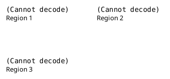

\newpage

# Introduction

L'objectif de ce travail pratique est de réutiliser le code parallélisé permettant de calculer l'ensemble de Mandelbrot, créé lors du travail pratique précédent, de sélectionner 2 régions de l'ensemble de Mandelbrot, de faire varier l'ordonnanceur entre statique et dynamique, ainsi que sa granularité pour les 2 régions choisies, et d'analyser les résultats obtenus.

Un ordonnanceur permet d'indiquer comment distribuer les itérations d'une boucle aux threads actifs.
Les itérations sont regroupées en blocs avant d'être distribuées aux différents threads.
La granularité de l'ordonnanceur donne le nombre d'itérations par bloc.

Dans le travail pratique, on va étudier les avantages et désavantages des ordonnanceurs statiques et dynamiques.
Un ordonnanceur statique attribue les blocs entre les threads au moment de la compilation.
Un ordonnanceur dynamique attribue les blocs entre les threads au moment de l'exécution.

# Méthodologie

Voici la structure de mon code:


```shell
├── graph.py
├── Makefile
├── rapport.pdf
├── run.sh
└── src
    ├── dynamic.cpp
    ├── global.hpp
    ├── static.cpp
    ├── writer.cpp
    └── writer.hpp
```

Il y a un code qui permet de faire uniquement de l'ordonnancement statique (car cela se fait à la compilation) et un autre code qui permet de faire uniquement de l'ordonnancement dynamique (qui se fait à l'exécution).

J'ai défini la granularité de l'ordonnanceur dans le header `global.hpp`. C'est une variable constante afin que le compilateur puisse faire des optimisations.

Lorsque l'on compile le code, on a tp6 qui est notre exécutable, et le résultat de notre fractal est enregistré dans un fichier `.bmp`, qui possède dans son nom le nombre d'itérations utilisé.
J'ai réutilisé le writer.cpp du travail pratique 3 afin de créer le fichier `.bmp` pour visualiser le résultat obtenu.

Mon code est presque le même que le code rendu au travail pratique précédent, dupliqué en 2 fichiers permettant une exécution avec ordonnanceur statique (`static.cpp`), et une exécution avec ordonnanceur dynamique (`dynamic.cpp`).
C'est pourquoi, je vais uniquement expliquer les changements, et les grandes parties de mon code.

Mon code est divisible en 3 parties. Une première partie permettant de gérer les options données par l'utilisateur, une seconde partie permettant de calculer l'ensemble de Mandelbrot en section parallèle, et une dernière partie consistant à enregistrer dans un fichier `.bmp` les résultats obtenus, et à afficher le temps d'exécution, et d'autres informations, comme le nombre de threads utilisé, le type d'ordonnanceur utilisé...

On peut donner comme option le nombre d'itérations.
```bash
./tp6 -i 256
```
On peut donner comme option le nombre de threads actifs en section parallèle.
```bash
./tp6 -n 16
```
On peut donner comme option les coordonnées du `top left` (`tl`) et du `bottom right` (`br`) de la vue de notre fractal.
```bash
./tp6 -c -1 -1 1 1
```
Enfin, on peut afficher une aide:
```bash
./tp6 -h
Usage: ./tp6
	-i [iterations]
	-n [number of threads]
	-c [tl_x tl_y br_x br_y]
```

Si on donne aucun paramètre, le nombre d'itérations par défaut est 256, et la vue par défaut de notre fractal est `tl(0.3475, 0.3475)` et `br(0.36, 0.36)`.
Le nombre par défaut de thread est donné par notre machine. La granularité de l'ordonnanceur est donnée dans le fichier `global.hpp`

On peut combiner les paramètres entre eux... Voici le résultat de cette exécution:
```bash
./tp6_static -n 4 -i 100

Execution time: 2.25746
Number of threads: 4
Number of iterations: 100
Schedule: static
Chunk size: 4
```

Voici comment l'ordonnanceur est traité:
```C++
#pragma omp for collapse(2) schedule(static, chunk_size)
```

Ici, j'indique que je désire avoir un ordonnanceur statique, avec une granularité donnée par `chunk_size`, définie dans `global.hpp`.

À la fin de mon code j'affiche également les informations concernant l'ordonnanceur.


# Résultats

J'ai exécuté mon programme en variant la région où on calcule notre fractal (en changeant les coordonnées de `top left` et de `bottom right`), et en variant le type et la granularité de l'ordonnanceur.

La première région est donnée par `tl(0.3602, 0.35656)` et `br(0.3612, 0.35756)`. Je l'ai choisie car le nombre d'itérations est relativement bien réparti: nous avons une charge de travail bien réparti sur toute l'image.

La deuxième région est donnée par `tl(0.3, 0.3)` et `br(0.5, 0.5)`. Je l'ai choisie car le nombre d'itérations n'est pas très bien réparti.
En effet, on peut constater en regardant l'image que à gauche, on a un grand nombre d'itérations, et à droite de l'image, on a un faible nombre d'itérations...

Et la troisième région est donnée par `tl(-2, -2)` et `br(2, 2)`. Il s'agit de la vue d'ensemble de l'ensemble de Mandelbrot.

Voici les trois régions que j'ai choisi pour exécuter mon code:


J'ai exécuté tout mon code avec seulement 32 cpus, donc j'ai fait varier le nombre de threads de 8 à 64 en puissance de 2.
J'ai essayé des chunk size allant de 1 à 2048 (en puissance de 2), et un nombre d'itérations allant de 128 à 1024 (en puissance de 2).
Les résultats que j'ai obtenus n'ont pas été très concluant...
Voici les graphiques que j'ai fait en fixant soit le nombre de threads, soit le nombre d'itérations, soit le `chunk_size`:

```plantuml
@startuml

<style>
note {
    backgroundcolor white
    linecolor transparent
}
</style>

note as img_1
    <img:/home/darcy/Documents/parallelism/images/graph_1.png>
end note

note as img_2
    <img:/home/darcy/Documents/parallelism/images/graph_2.png>
end note

img_1 -[hidden]d-> img_2
@enduml
```



# Discussion

Tout d'abord, commençons par expliquer ce qu'est un ordonnanceur statique, un ordonnanceur dynamique, et quelles sont les principales différences et avantages des deux.

Un ordonnanceur permet de diviser une boucle en bloc d'itérations et de les répartir entre tous les threads actifs.
Un ordonnanceur statique attribue les blocs d'itération avant la compilation.
Le `chunk_size` est le nombre d'itérations par bloc, donné en travail aux threads.
Comme les blocs d'itérations sont attribués avant la compilation, le compilateur ne sait pas forcément quelle est la quantité de travail pour chaque itérations et ne considère pas qu'un bloc d'itération puisse représenter plus de travail qu'un autre bloc d'itération.
Le compilateur agence donc les blocs d'itération sans tenir compte de la quantité de travail de chaque bloc.
Ce qui est un soucis si on a un calcul mal réparti, on va avoir des threads qui seront inactifs, car ils auront fini le travail qui leur aura été attribué pendant que d'autres threads seront en train de travailler, et pendant que le programme attend que les threads qui travaillent finissent de travailler pour continuer à donner le travail dans l'ordre déterminé par le compilateur.
Donc un ordonnanceur statique est très utile si le travail de chaque bloc est constant, car il va optimiser à la compilation la répartition des blocs (en général, il va suivre un procédé de Round-Robin car il considère que chaque bloc va prendre le même temps.... A reformuler...).
Cependant, si le travail est mal réparti, l'ordonnanceur statique n'est pas idéal, car comme tout est défini à la compilation, des threads vont avoir pas beaucoup de travail et être inactif pendant que d'autres threads travaillent, ce qui augmente l'overhead et diminue les performances...

Un ordonnanceur dynamique attribue les blocs d'itérations au moment de l'exécution du programme.
L'ordonnanceur dynamique peut donc donner directement le bloc suivant à un thread ayant fini son bloc avant les autres, si ce bloc n'a pas de dépendance avec un autre bloc en cours d'exécution.
Ainsi, si on a un travail mal réparti, l'ordonnanceur dynamique va minimiser l'overhead en essayant de toujours donner des blocs aux threads ayant fini leur travail.

Donc l'ordonnanceur statique est, en théorie, censé donner de meilleurs résultats pour des blocs ayant tous la même charge de travail, et l'ordonnanceur dynamique est censé donner de meilleurs résultats si les blocs ont des charges de travail très différentes.

En observant les résultats obtenus, on peut remarquer que effectivement, l'ordonnanceur statique est plus lent que l'ordonnanceur dynamique sur les régions 2 et 3, mais sur la région 1, on n'a pas de grande différence entre ordonnanceur statique et dynamique...

On peut également remarquer que les temps d'exécutions obtenus avec ordonnanceur statique et dynamique sont très proche et inconstant.
En effet, lorsque l'on fait varier le chunk size, les temps d'exécutions varient beaucoup...
Peut-être que prendre un problème avec un travail constant par bloc nous permettrait de voir effectivement une différence notable entre ordonnanceur statique et dynamique, car les résultats nous laissent simplement penser que l'ordonnanceur dynamique est équivalent, voire meilleur que l'ordonnanceur statique pour l'ensemble de Mandelbrot...

Comme je ne vois pas trop de différence, j'ai décidé de choisir une région à l'intérieur de l'ensemble de Mandelbrot et de calculer les différences entre ordonnanceur statique et dynamique, car on devrait avoir une différence plus notable, étant donné que la charge de travail est censé être constante par blocs.
J'ai donc fixé le nombre d'itérations à 1024 pour avoir suffisamment de travail par blocs.

Voici les résultats que j'ai obtenu pour cette dernière région choisie:
# Conclusion

Pour conclure, pour chaque problème donné, on a plusieurs défis à relever.
Tout d'abord, on doit essayer de paralléliser le plus possible le code.
Ensuite, lorsque le code est parallélisé, on doit trouver le nombre de threads maximisant l'efficacité de la parallélisation.

Il faut donc trouver le juste équilibre pour chaque programme entre nombre de threads utilisé et gain de performance.
