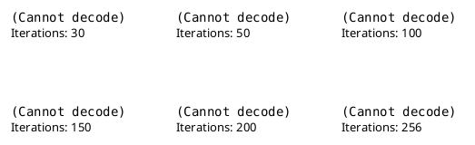
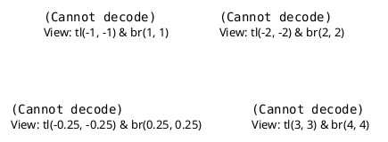

\newpage

# Introduction

Dans ce travail pratique, nous allons utiliser openmp et C++ pour calculer l'ensemble de Mandelbrot, qui est une fractal célèbre en mathématique.
L'objectif de ce travail pratique est de paralléliser le code permettant de calculer l'ensemble de Mandelbrot et de varier le nombre de threads s'exécutant pour calculer cet ensemble.
Afin de faire un petit rappel, un processus est un programme qui est en cours d'exécution, et chaque processus possède sa propre mémoire virtuelle. Les threads composent un processus, ils se partagent la mémoire virtuelle du processus, mais chacun possède sa propre pile d'exécution. On va donc faire varier le nombre de threads du processus et observer les différences du temps d'exécution du programme.

# Méthodologie

Voici la structure de mon code:


```shell
├── Makefile
└── src
    ├── main.cpp
    ├── writer.cpp
    └── writer.hpp
```


Lorsque l'on compile et exécute le code, on obtient la structure suivante:


```shell
├── Makefile
├── src
│   ├── main.cpp
│   ├── writer.cpp
│   └── writer.hpp
├── T_0256.bmp
└── tp5
```
On a tp5 qui est notre exécutable, et le résultat de notre fractal est enregistré dans le fichier `.bmp`, qui possède dans son nom le nombre d'itérations utilisé.
J'ai réutilisé le writer.cpp du travail pratique 3 afin de créer le fichier `.bmp` pour visualiser le résultat obtenu.

Dans une première partie de mon code, je m'occupe de traiter les informations données par l'utilisateur afin de bien initialiser notre fractal.
Pour cela, j'utilise la fonction getopt définie dans `unistd.h`. Cette fonction détecte les options données à notre programme.
```C++
while ((option = getopt(argc, argv, "i:n:c:h")) != -1) {
		switch (option) {
            // Look after options here
        }
}
```
Ici, on boucle sur `getopt` tant que celui-ci trouve des options (qui sont toujours précédées par `-`).
Quand `getopt` ne trouve plus d'options, il renvoie `-1`. À ce moment, on quitte la boucle.
Les options acceptées sont données par `"i:n:c:h"`. Le `:` après l'option signifie que celle-ci prend au moins un paramètre.
C'est uniquement utile pour récupérer directement le paramètre de la fonction dans la variable `optarg` de `getopt`.
Avant d'appeler `getopt`, je met la variable `opterr` de `getopt` à 0, ce qui évite que `getopt` affiche des commentaires sur la sortie standard.

On peut donner comme option le nombre d'itérations:
```bash
./tp5 -i 256
```
On peut également donner comme option le nombre de threads actifs en section parallèle:
```bash
./tp5 -n 16
```
On peut donner comme option les coordonnées du `top left` (`tl`) et du `bottom right` (`br`) de la vue de notre fractal.
```bash
./tp5 -c -1 -1 1 1
```
Enfin, on peut afficher une aide:
```bash
./tp5 -h

Usage: ./tp5 -i [iterations] -n [number of threads] -c [tl_x tl_y br_x br_y]
```

Si on donne aucun paramètre, le nombre d'itérations par défaut est 100, et la vue par défaut de notre fractal est `tl(-2, -2)` et `br(2, 2)`.
Le nombre par défaut de thread est donné par notre machine.

On peut combiner les paramètres entre eux... Voici le résultat de cette exécution:
```bash
./tp5 -i 250 -n 16 -c -1 -1 1 1

Execution time: 0.871114
Number of threads: 16
Number of iterations: 250
```

Dans le `switch`, si l'option `n` est donnée, alors on met à jour le nombre de threads qui seront actifs en section parallèle.
Pour ce faire, on utilise la primitive `omp_set_num_threads(nthreads)`, et on lui donne en paramètre un nombre qui sera le nombre de threads actifs en section parallèle.

Le coeur de mon code se passe dans ces lignes:
```C++
// Define scale
double x_scale = (br[0] - tl[0]) / 1000.;
double y_scale = (br[1] - tl[1]) / 1000.;

// Calculate our fractal. Collapse is used to merge the two for loop.
#pragma omp parallel
{
	nthreads = omp_get_num_threads();

	#pragma omp for collapse(2)
	for (int y = 0; y < 1000; y++) {
		for (int x = 0; x < 1000; x++) {
			complex<double> c(x * x_scale + tl[0], y * y_scale + tl[1]);
			complex<double> z(0, 0);
			int n = 0;
			while (abs(z) < 2. && n < iterations) {
				z = (z * z) + c;
				n++;
			}
			pFractal[y * 1000 + x] = (double) n / (double) iterations;
		}
	}
}
``` 
J'ai réutilisé le code donné dans l'énoncé. Cependant, à la place de `fractal_tl.x` etc, j'ai créé un vecteur `tl` et `br` qui possèdent les coordonnées `x` et `y`. Ainsi, on a:


`fractal_tl.x == tl[0] && fractal_tl.y == tl[1] && fractal_br.x == br[0] && fractal_br.y == br[1]`


Puis j'ai parallélisé le code donné dans l'énoncé. Je commence par utiliser la primitive `#pragma omp parallel` indiquant que le code s'exécutant entre `{` et `}` va s'exécuter avec le nombre de threads donné par la primitive `omp_set_num_threads(nthreads)`, ou alors avec un nombre de threads défini par la machine si la primitive `omp_set_num_threads(nthreads)` n'a pas été appelée.

Ensuite, j'ai appelé la primitive `omp_get_num_threads()` afin de savoir combien de threads sont actifs dans la région parallèle.
(Cette primitive retourne uniquement le nombre de threads actifs, donc si on l'utilise en dehors d'une région parallèle, elle retournera 1 car seulement 1 thread sera actif)

Puis j'ai exécuté les boucles for en parallèle grâce à la primitive `#pragma omp for collapse(2)`.
Au fait, il s'agit ici de 2 primitives utilisées:
La primitive `collapse(2)` ajouté à la primitive `#pragma omp for` permet de prendre les 2 boucles for, et le les rassembler dans une grosse boucle for.
Ensuite, la primitive `#pragma omp for` divise cette grosse boucle for entre tous les threads actifs, qui auront donc chacun un bout de la boucle for à exécuter.

Ensuite, chaque thread stocke son résultat dans le vecteur `pFractal` qui est partagé entre tous les threads.
Notons que nous n'avons pas de problème d'accès concurrent à la mémoire car chaque thread va écrire à un endroit différent dans le vecteur `pFractal`, utilisé pour stocker le résultat.
Notons également que je divise `n` par le nombre d'itérations maximal `iterations`, car cela me permet d'avoir un nombre compris entre 0 et 1, ce qui est nécessaire plus tard pour créer l'image `.bmp`

Enfin, lorsqu'on est sorti de la section parallèle délimitée par les `{}`, il n'y a de nouveau qu'un seul thread d'actif qui continue à exécuter la suite du code.

On écrit alors le résultat dans un fichier `.bmp` afin de pouvoir visualiser notre fractal obtenue.
```C++
write_to_bmp(1000, pFractal, iterations, 0, 1);
```
La fonction prend en paramètre la taille du vecteur 2D, un vecteur 1D qui sera interprété comme un vecteur 2D, le nombre d'itérations qui sera utiliser pour nommer le fichier, le minimum que je défini à 0 et le maximum que je défini à 1 car, comme je l'ai expliqué précédement, toutes les valeurs de `pFractal` sont comprises entre 0 et 1.


Notez ici que j'ai légèrement modifié la fonction `write_to_bmp` car je lui ai passé en paramètre un vecteur 1D et non pas un vecteur 2D, comme la fonction était écrite pour le travail pratique 3.
Pour cela, j'ai simplement changé la signature de la fonction et également une ligne de la fonction. Il s'agit de cette ligne :
```C++
double value = ((data[iY][iX] - minval) / (maxval - minval));
```
qui a été remplacée par cette ligne:
```C++
double value = ((data[iY * N + iX] - minval) / (maxval - minval));
```
afin d'accéder aux éléments de `data` comme si c'était un vecteur 2D alors que c'est un vecteur 1D.

Enfin, à la fin du code, on affiche les différents résultats, comme le temps d'exécution du programme (donné en secondes), le nombre de threads et le nombre d'itérations utilisé.

# Résultats

J'ai exécuté mon programme en variant la région où on calcule notre fractal (en changeant les coordonnées de `top left` et de `bottom right`), en variant le nombre d'itérations et en variant le nombre de threads utilisés pour effectuer le calcul. Voici les résultats que j'ai pu obtenir en variant le nombre d'itérations:


Et voici le résultat obtenu en variant la région:


Si on regarde le temps d'exécution de notre programme pour 32 threads actifs pour un nombre variant d'itérations, on a la courbe suivante:

On peut remarquer que le temps d'exécution augmente linéairement, voire quadratiquement.
Pour la suite des calculs, j'ai fixé le nombre d'itérations à 256 car cela permet d'avoir des calculs suffisamment important pour pouvoir observer des différences notables dans les temps d'exécutions en fonction du nombre de threads utilisé.

Ensuite, j'ai décidé de faire varier le nombre de threads actifs en région parallèle pour différentes régions:

J'ai choisi une région permettant de voir une vue globale (tl(-2, -2) & br(2, 2)) et toute notre fractal est définie dans cette région car on a fixé sa définition au cercle de rayon 2 en bornant la valeur absolue de z par 2.
J'ai également choisi une région permettant d'avoir une vue d'un peu plus près (tl(-1, -1) & br(1, 1)), une autre région (tl(-0.25, -0.25) & br(0.25, 0.25)) qui apparaît en rouge car elle est entièrement dans la fractal, et une région complètement en dehors de la fractal (tl(3, 3) & br(4, 4)), qui apparaît alors en bleu dans les images montrant les différentes régions choisies.

J'ai obtenu pour ces régions choisies les temps d'exéctutions suivant:


# Discussion

Afin de pouvoir discuter plus facilement du comportement et des performances du programme, j'ai calculé un speed up ampirique, permettant de déterminer l'efficacité de la parallélisation, que j'ai défini de la sorte:
$$S = \frac{T_{seq}}{T_{par}} \approx \frac{\text{Time execution with one thread}}{\text{Time execution (with one or more threads)}}$$
Cela me donne le graphique suivant:

Nous pouvons observer des choses intéressantes grâce aux deux graphiques.

Tout d'abord, le temps d'exécution et le speed up restent constant dans un cas où on se trouve dans la région qui n'est pas du tout dans la fractal.
Mais on peut constater qu'à la fin, pour un nombre très élevé de threads, le temps d'exécution se met à augmenter et dépasse le temps d'exécution mis avec 1 thread.
Cela est dû au problème de l'overhead: il y a beaucoup de threads actifs, mais tous n'ont pas forcément du travail à faire.
Cela est également dû au fait que la division du travail entre tous les threads est de plus en plus grand et le temps de calcul de chaque thread est de plus en plus petit, ce qui fait également augmenter le temps de calcul car les threads passent alors plus de temps à discuter entre eux, plutôt qu'à travailler.
Ces raisons expliquent également pourquoi le speed up atteint un sommet, puis diminue après avoir atteint ce sommet, car du temps est perdu car on peut avoir plus de threads actifs que de travail, ou encore on peut également avoir une division du travail qui prend un temps de plus en plus élevé, et le travail à exécuter devenant de plus en plus petit.

Ensuite, nous pouvons constater que le temps d'exécution pour la vue générale et la région un peu plus rapprochée possèdent des anomalies: cela ne ressemble pas à une jolie courbe, comme par exemple la courbe obtenue par les temps d'exécutions pour la région à l'intérieur de l'ensemble de Mandelbrot.
Je pense que cela est causé par une indisposition des ressources dans baobab, mais j'avoue que je ne comprend pas trop pourquoi on a ces anomalies.


Une autre chose que l'on peut constater est que plus on a des éléments dans l'ensemble de Mandelbrot, plus le temps d'exécution est élevé. Cela est tout à fait logique, car les éléments de l'ensemble de Mandelbrot vont itérer un grand nombre de fois dans la boucle donnée par:
```C++
 
while (abs(z) < 2. && n < iterations) {
	z = (z * z) + c;
	n++;
}
```
car ils vont itérer jusqu'à un nombre proche de `iterations`, indiquant ainsi qu'ils appartiennent à l'ensemble de Mandelbrot.

On peut également remarquer que plus le travail est grand, plus le speed up est élevé, car pour la région se trouvant entièrement dans l'ensemble de Mandelbrot, le temps d'exécution est plus élevé, pour la raison mentionnée précédement, et le speed up est également le plus élevé, ce qui signifie que la division du problème en plusieurs threads est plus efficace lorsque le problème est plus grand, ce qui vérifie la loi de Gustafson disant que la parallélisation est plus efficace pour les plus grands problèmes.
 
Enfin, on peut remarquer que le nombre de threads maximisant le speed up est donné par approximativement $2^{4}$ pour la région à l'extérieur de l'ensemble de Mandelbrot, $2^{7}$ pour la vue d'ensemble, $2^{9}$ pour la région un peu plus rapprochée de l'ensemble de Mandelbrot et pour la région à l'intérieur de l'ensemble de Mandelbrot.
Et à chaque fois que le nombre de threads maximisant le speed up est élevé, on a que le speed up est plus élevé que lorsqu'un nombre faible de threads maximise le speed up.
On peut alors observer que la loi de Gustafson est à nouveau vérifiée, car cela montre que plus le problème est élevé, plus on a besoin de threads pour maximiser le speed up, mais plus le speed up est élevé, donc plus la parallélisation est efficace.


# Conclusion

L'étude du temps d'exécution de notre programme calculant l'ensemble de Mandelbrot nous a permis de vérifier ampiriquement la loi de Gustafson: on a effectivement pu constater que plus le travail est conséquent, et plus le speed up est élevé, mais plus le nombre de threads maximisant le speed up est élevé.
Mais si on dépasse le nombre de threads maximisant le speed up, on a le speed up qui diminue, donc l'efficacité de notre parallélisation devient moins bonne.
En effet, si on a trop de threads actifs pour exécuter les sections parallèles, on a des problèmes de overhead et également de temps de "discussion" entre threads augmentant de manière significative comparée au temps de travail de chaque thread.

Pour conclure, pour chaque problème donné, on a plusieurs défis à relever.
Tout d'abord, on doit essayer de paralléliser le plus possible le code.
Ensuite, lorsque le code est parallélisé, on doit trouver le nombre de threads maximisant l'efficacité de la parallélisation.

Il faut donc trouver le juste équilibre pour chaque programme entre nombre de threads utilisé et gain de performance.
